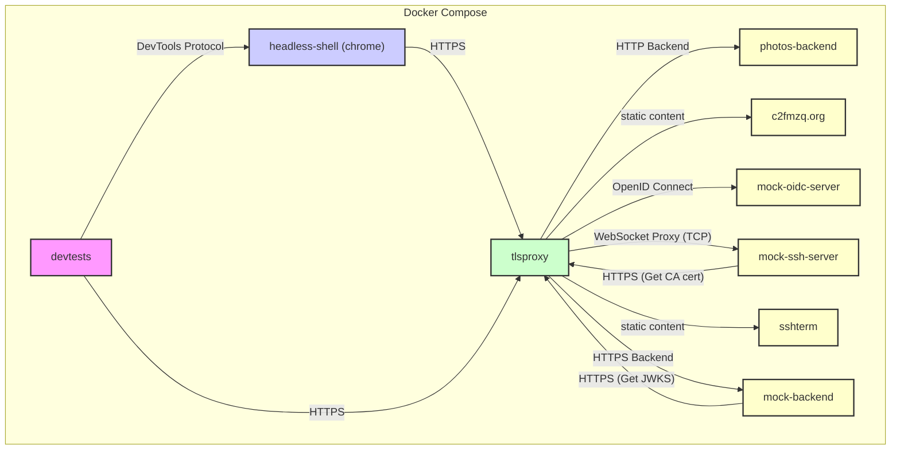

# Integration Tests

This repository contains integration tests for a system composed of `tlsproxy`, `photos`, and `sshterm` services. The tests are orchestrated using `docker compose`.

## Architecture

The following diagram shows the architecture of the integration test environment:



The services are:

*   **`devtests`**: The main test container that runs the integration tests written in Go.
*   **`headless-shell`**: A headless Chrome browser used to perform UI tests.
*   **`tlsproxy`**: A TLS proxy that provides HTTPS termination, OIDC authentication, and routing to the backend services.
*   **`photos-backend`**: The backend for the photos application.
*   **`c2fmzq.org`**: The c2fmzq.org website, served as static content.
*   **`mock-oidc-server`**: A mock OIDC server for testing authentication.
*   **`mock-ssh-server`**: A mock SSH server for testing `sshterm`.
*   **`sshterm`**: A web-based SSH terminal, served as static content by the `tlsproxy` service.
*   **`mock-backend`**: A mock backend running TLSPROXY's example backend.

## Tests

The integration test suite includes the following tests:

*   **Photos**: Creates a new user account in the photos application, logs in, and uploads a JPG image.
*   **SSO**: Verifies the Single Sign-On (SSO) flow with the mock OIDC server.
*   **SSHTerm**: Navigates to the `sshterm` page, generates a new SSH key, obtains a certificate from an SSH Certificate Authority, and connects to the mock SSH server.
*   **PKI**: Navigates to the PKI endpoint, generates a new X.509 key and certificate, and uses them for client authentication.

## Prerequisites

To run the tests, you need to have Docker installed and configured to run without `sudo`. You can add your user to the `docker` group with the following command:

```bash
sudo usermod -aG docker ${USER}
```

After running this command, you will need to log out and log back in for the changes to take effect.

## Running the tests

To run the tests, execute the following command:

```bash
./run-integration-tests.sh
```

This script will:

1.  Clone the required git repositories for `tlsproxy`, `photos`, and `sshterm`.
2.  Build the necessary Docker images.
3.  Run the integration tests using `docker compose`.
